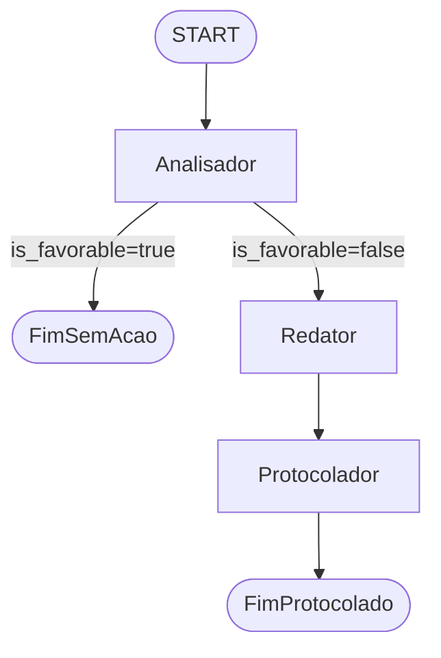

# AI Multi-Agent Orchestrator — Legal Tech PoC

> **AVISO: PROVA DE CONCEITO (PoC)**
>
> Este projeto é **exclusivamente** para fins de estudo, demonstração de arquitetura e avaliação técnica.
> **Não deve ser utilizado em produção** nem substitui parecer ou atuação de advogado(a).
> Nenhum documento gerado possui validade jurídica.

PoC de **Automação Jurídica (Legal Tech)** utilizando **Multi-Agent Orchestration** com máquinas de estado determinísticas (LangGraph).

## O Problema de Negócio

Escritórios de advocacia e departamentos jurídicos monitoram diariamente publicações judiciais (sentenças, decisões, despachos). Quando uma decisão é **desfavorável** ao cliente, é necessário:

1. Analisar o teor da publicação
2. Elaborar contrarrazão ou recurso
3. Protocolar a peça no tribunal dentro do prazo

Esse fluxo é repetitivo, sensível a prazos e exige rastreabilidade. Esta PoC automatiza esse pipeline com IA em etapas cognitivas pontuais e controle determinístico do fluxo via LangGraph.

## A Abordagem

O fluxo é modelado como um **grafo de estados determinístico** (LangGraph). O código tradicional controla **quando** e **para onde** o fluxo avança; a IA é invocada apenas nas etapas cognitivas:

| Nó | Papel | LLM |
|---|---|---|
| **Analisador** | Determina se a decisão é favorável ou desfavorável | Sim (structured output) |
| **Redator** | Elabora contrarrazão/recurso (somente se desfavorável) | Sim |
| **Protocolador** | Simula protocolo da peça via API de tribunal | Não |

## Diagrama de Arquitetura



## Por que State Machines e não Agentes Autônomos Puros?

No ramo jurídico, previsibilidade e controle não são opcionais:

| Aspecto | State Machine (LangGraph) | Agente autônomo puro |
|---|---|---|
| **Ordem processual** | Fluxo rígido: análise → peça → protocolo | Modelo pode pular etapas ou repetir ações |
| **Audit trail** | Cada transição é registrada e testável | Decisões opacas e difíceis de reproduzir |
| **Validação humana** | Checkpoints explícitos antes do protocolo | Risco de protocolo automático indevido |
| **Compliance** | Regras de negócio em Python, versionadas | Lógica espalhada em prompts frágeis |
| **Loops infinitos** | Impossíveis — edges condicionais com limites | Risco real em produção |
| **Alucinações** | LLM atua só onde há valor; fluxo não depende dela | Erro cognitivo pode desviar todo o processo |

A IA complementa o fluxo jurídico; **não o substitui**.

## Estrutura do Projeto

```
ai-multi-agent-orchestrator/
├── src/
│   ├── api/
│   │   ├── main.py         # Entry point FastAPI
│   │   └── routes.py       # POST /api/v1/process-publication
│   ├── agents/
│   │   └── nodes.py        # analyzer_node, drafter_node, filer_node
│   ├── core/
│   │   ├── state.py        # LegalState (TypedDict)
│   │   ├── graph.py        # legal_workflow (LangGraph)
│   │   └── config.py       # Settings + OPENAI_API_KEY
│   └── utils/
├── tests/
├── Dockerfile
├── docker-compose.yml
└── pyproject.toml
```

## Configuração do `.env`

**Obrigatório** para invocar o workflow com LLM real:

```bash
cp .env.example .env
```

Edite `.env`:

```env
OPENAI_API_KEY=sk-sua-chave-aqui
OPENAI_MODEL=gpt-4o-mini
APP_ENV=development
LOG_LEVEL=INFO
```

## Guia de Teste — Passo a Passo

### 1. Clone e entre no diretório

```bash
git clone https://github.com/dantonissler/ai-multi-agent-orchestrator.git
cd ai-multi-agent-orchestrator
```

### 2. Configure a chave OpenAI

```bash
cp .env.example .env
# Edite .env e preencha OPENAI_API_KEY
```

### 3. Suba a aplicação

```bash
docker compose up --build
```

### 4. Verifique o health check

```bash
curl http://localhost:8000/health
# {"status":"ok"}
```

### 5. Dispare o fluxo com uma sentença de teste

```bash
curl -X POST http://localhost:8000/api/v1/process-publication \
  -H "Content-Type: application/json" \
  -d '{
    "text": "SENTENÇA: Ante o exposto, JULGO IMPROCEDENTE o pedido formulado pelo autor, condenando-o ao pagamento de custas e honorários advocatícios fixados em 10% sobre o valor da causa."
  }'
```

### 6. Observe os logs do LangGraph

```bash
docker compose logs -f api
```

Logs esperados (decisão desfavorável):

```
[INFO] publication.received length=...
[INFO] flow.step analyzer -> is_favorable=False
[INFO] flow.step drafter -> appeal_generated
[INFO] flow.step filer -> protocol_receipt=...
[INFO] publication.completed is_favorable=False protocol=Protocolo ... registrado...
```

### 7. Resposta esperada da API

**Decisão desfavorável** (fluxo completo):

| Campo | Descrição |
|---|---|
| `publication_text` | Texto enviado |
| `is_favorable` | `false` |
| `analysis_reason` | Justificativa do analisador LLM |
| `drafted_appeal` | Contrarrazão gerada pelo redator LLM |
| `protocol_receipt` | Confirmação simulada de protocolo |

**Decisão favorável** (fluxo encerra após análise):

| Campo | Descrição |
|---|---|
| `is_favorable` | `true` |
| `analysis_reason` | Justificativa |
| `drafted_appeal` | Ausente |
| `protocol_receipt` | Ausente |

### 8. Swagger UI

Abra [http://localhost:8000/docs](http://localhost:8000/docs) e teste `POST /api/v1/process-publication`.

### Alternativa — Local com uv

```bash
uv sync
uv run uvicorn api.main:app --reload --app-dir src --host 0.0.0.0 --port 8000
```

Hot-reload no Docker:

```bash
docker compose --profile dev up api-dev --build
```

## Variáveis de Ambiente

| Variável | Descrição | Padrão |
|---|---|---|
| `OPENAI_API_KEY` | Chave OpenAI (**obrigatória** para processar publicações) | — |
| `OPENAI_MODEL` | Modelo LLM | `gpt-4o-mini` |
| `APP_ENV` | Ambiente da aplicação | `development` |
| `LOG_LEVEL` | Nível de log | `INFO` |

## Comandos de Desenvolvimento

```bash
uv run pytest -v
uv run ruff check src tests
```

## Stack Tecnológica

- **Python 3.11+** · **FastAPI** · **LangGraph** · **LangChain OpenAI** · **Pydantic** · **uv**

## Próximos Passos

- [ ] Checkpoint de validação humana antes do protocolo
- [ ] Testes de integração end-to-end com LLM real (marcados com `@pytest.mark.integration`)
- [ ] Integração real com API de tribunal

## Licença

Projeto de PoC — uso interno e fins de estudo.
