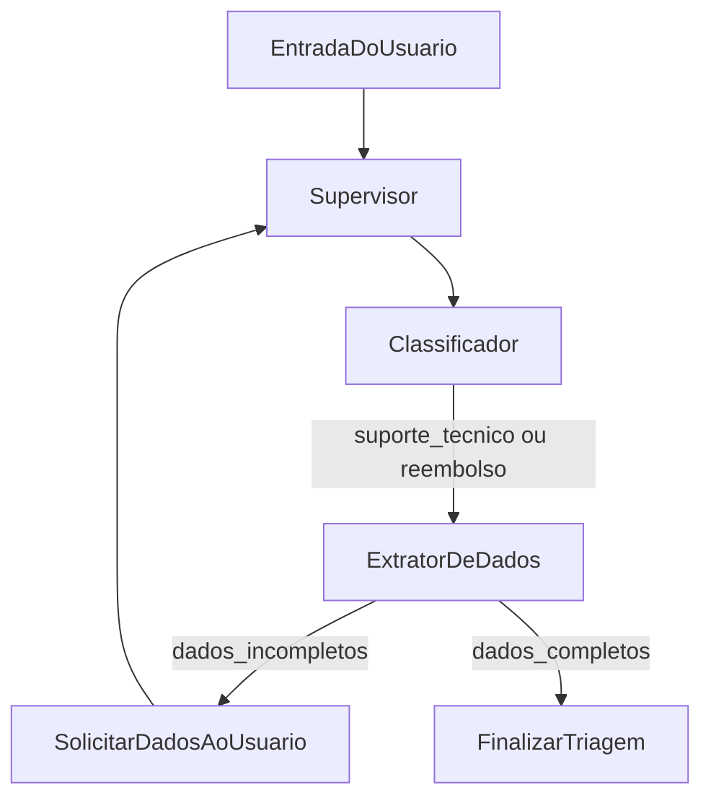

# AI Multi-Agent Orchestrator

PoC de **Triagem de Tickets de Suporte e Aprovação Corporativa** utilizando **Multi-Agent Orchestration** com máquinas de estado determinísticas (LangGraph).

## O Problema

Equipes de suporte e aprovação corporativa recebem tickets heterogêneos — pedidos de suporte técnico, solicitações de reembolso e outros tipos de demanda — que exigem classificação, extração de dados estruturados e validação antes de seguir para o fluxo correto. Fazer isso manualmente é lento, inconsistente e difícil de auditar.

## A Abordagem

Este projeto modela o fluxo como um **grafo de estados determinístico** (LangGraph). O código tradicional controla **quando** e **para onde** o fluxo avança; a IA é invocada apenas em etapas cognitivas pontuais:

| Nó | Papel |
|---|---|
| **Supervisor** | Consolida contexto e coordena o fluxo |
| **Classificador** | Decide se o ticket é suporte técnico ou reembolso |
| **Extrator** | Valida se as informações necessárias estão presentes |

Transições, loops e finalização são definidos por código — não por decisões autônomas do modelo.

## Diagrama de Arquitetura



## Por que State Machines e não Agentes Autônomos Puros?

| Aspecto | State Machine (LangGraph) | Agente autônomo puro |
|---|---|---|
| **Controle de fluxo** | Determinístico — transições explícitas no código | Modelo decide próximo passo (imprevisível) |
| **Loops infinitos** | Impossíveis — edges condicionais com limites | Risco real em produção |
| **Auditoria** | Cada transição é rastreável e testável | Difícil reproduzir decisões |
| **Custo e latência** | LLM chamada só onde há valor cognitivo | Modelo pode "pensar" desnecessariamente |
| **Manutenção** | Regras de negócio em Python, não em prompts | Lógica espalhada em instruções frágeis |

A IA complementa o fluxo; **não o substitui**.

## Estrutura do Projeto

```
ai-multi-agent-orchestrator/
├── src/
│   ├── api/          # Rotas FastAPI
│   ├── agents/       # Nós cognitivos: supervisor, classifier, extractor
│   ├── core/         # Config, schemas Pydantic, definição do StateGraph
│   └── utils/
├── tests/
├── Dockerfile
├── docker-compose.yml
├── pyproject.toml
└── README.md
```

## Quickstart

### Pré-requisitos

- [Docker](https://docs.docker.com/get-docker/) e Docker Compose **ou**
- Python 3.11+ e [uv](https://docs.astral.sh/uv/)

### Opção 1 — Docker (recomendado)

```bash
# Clone o repositório e entre no diretório
cd ai-multi-agent-orchestrator

# (Opcional) Configure variáveis de ambiente
cp .env.example .env

# Suba a aplicação
docker compose up --build
```

A API estará disponível em [http://localhost:8000](http://localhost:8000).

Verifique o health check:

```bash
curl http://localhost:8000/health
# {"status":"ok"}
```

Documentação interativa: [http://localhost:8000/docs](http://localhost:8000/docs)

### Opção 2 — Local com uv

```bash
cd ai-multi-agent-orchestrator

# Instale dependências (inclui dev)
uv sync

# (Opcional) Configure variáveis de ambiente
cp .env.example .env

# Inicie o servidor com hot-reload
uv run uvicorn api.main:app --reload --app-dir src --host 0.0.0.0 --port 8000
```

## Variáveis de Ambiente

| Variável | Descrição | Padrão |
|---|---|---|
| `OPENAI_API_KEY` | Chave da API OpenAI (necessária quando os agentes forem implementados) | — |
| `APP_ENV` | Ambiente da aplicação | `development` |
| `LOG_LEVEL` | Nível de log | `INFO` |

Copie `.env.example` para `.env` e ajuste conforme necessário.

## Comandos de Desenvolvimento

```bash
# Rodar testes
uv run pytest

# Lint
uv run ruff check src tests

# Formatação (auto-fix imports e estilo)
uv run ruff check --fix src tests
```

## Stack Tecnológica

- **Python 3.11+**
- **FastAPI** — API HTTP
- **LangGraph** — orquestração de agentes via state machines
- **LangChain OpenAI** — integração com modelos LLM
- **Pydantic** — validação de schemas
- **uv** — gerenciamento de dependências
- **pytest / ruff** — testes e lint

## Próximos Passos

- [ ] Implementar nós cognitivos (`supervisor`, `classifier`, `extractor`)
- [ ] Definir o StateGraph com conditional edges em `src/core/graph.py`
- [ ] Expor endpoint de triagem de tickets na API
- [ ] Adicionar testes de integração do grafo

## Licença

Projeto de PoC — uso interno.
