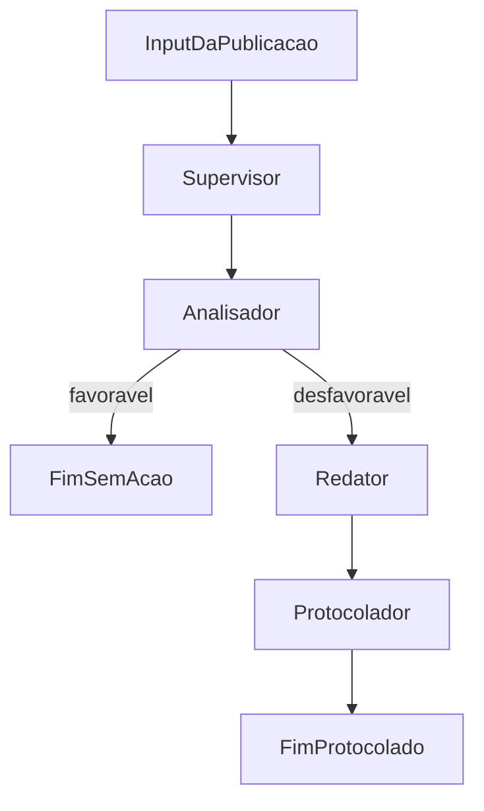

# AI Multi-Agent Orchestrator — Legal Tech PoC

> **AVISO: PROVA DE CONCEITO (PoC)**
>
> Este projeto é **exclusivamente** para fins de estudo, demonstração de arquitetura e avaliação técnica.
> **Não deve ser utilizado em produção** nem substitui parecer ou atuação de advogado(a).
> Nenhum documento gerado possui validade jurídica.

PoC de **Automação Jurídica (Legal Tech)** utilizando **Multi-Agent Orchestration** com máquinas de estado determinísticas (LangGraph).

## O Problema de Negócio

Escritórios de advocacia e departamentos jurídicos monitoram diariamente publicações judiciais (sentenças, decisões, despachos). Quando uma decisão é **desfavorável** ao cliente, é necessário:

1. Analisar o teor da publicação
2. Elaborar contrarrazão ou recurso
3. Protocolar a peça no tribunal dentro do prazo

Esse fluxo é repetitivo, sensível a prazos e exige rastreabilidade. Esta PoC simula a automação desse pipeline com IA em etapas cognitivas pontuais e controle determinístico do fluxo.

## A Abordagem

O fluxo é modelado como um **grafo de estados determinístico** (LangGraph). O código tradicional controla **quando** e **para onde** o fluxo avança; a IA será invocada apenas nas etapas cognitivas:

| Nó | Papel |
|---|---|
| **Supervisor** | Consolida contexto processual e coordena transições |
| **Analisador** | Determina se a decisão é favorável ou desfavorável ao cliente |
| **Redator** | Elabora contrarrazão/recurso (somente se desfavorável) |
| **Protocolador** | Simula protocolo da peça via API de tribunal |

## Diagrama de Arquitetura



## Por que State Machines e não Agentes Autônomos Puros?

No ramo jurídico, previsibilidade e controle não são opcionais:

| Aspecto | State Machine (LangGraph) | Agente autônomo puro |
|---|---|---|
| **Ordem processual** | Fluxo rígido: análise → peça → protocolo | Modelo pode pular etapas ou repetir ações |
| **Audit trail** | Cada transição é registrada e testável | Decisões opacas e difíceis de reproduzir |
| **Validação humana** | Checkpoints explícitos antes do protocolo | Risco de protocolo automático indevido |
| **Compliance** | Regras de negócio em Python, versionadas | Lógica espalhada em prompts frágeis |
| **Loops infinitos** | Impossíveis — edges condicionais com limites | Risco real em produção |
| **Alucinações** | LLM atua só onde há valor; fluxo não depende dela | Erro cognitivo pode desviar todo o processo |

A IA complementa o fluxo jurídico; **não o substitui**.

## Estrutura do Projeto

```
ai-multi-agent-orchestrator/
├── src/
│   ├── api/              # Rotas FastAPI
│   │   └── routes/       # publications.py
│   ├── agents/           # supervisor, analyzer, drafter, filer
│   ├── core/             # config, schemas, graph
│   └── utils/
├── tests/
├── Dockerfile
├── docker-compose.yml
├── pyproject.toml
└── README.md
```

## Guia de Teste — Passo a Passo

Siga estes passos para avaliar a PoC do zero:

### 1. Clone e entre no diretório

```bash
git clone https://github.com/dantonissler/ai-multi-agent-orchestrator.git
cd ai-multi-agent-orchestrator
```

### 2. (Opcional) Configure variáveis de ambiente

```bash
cp .env.example .env
```

> Nesta fase stub, `OPENAI_API_KEY` **não é necessária**. Será exigida quando os agentes LLM forem implementados.

### 3. Suba a aplicação com Docker

```bash
docker compose up --build
```

Aguarde a mensagem indicando que o Uvicorn está rodando na porta 8000.

### 4. Verifique o health check

Em outro terminal:

```bash
curl http://localhost:8000/health
```

Resposta esperada:

```json
{"status":"ok"}
```

### 5. Dispare o fluxo com uma sentença de teste

```bash
curl -X POST http://localhost:8000/api/v1/publications/process \
  -H "Content-Type: application/json" \
  -d '{
    "publication_text": "SENTENÇA: Ante o exposto, JULGO IMPROCEDENTE o pedido formulado pelo autor, condenando-o ao pagamento de custas e honorários advocatícios fixados em 10% sobre o valor da causa.",
    "case_number": "0001234-56.2024.8.26.0100",
    "client_name": "Empresa XYZ Ltda",
    "court": "TJSP"
  }'
```

### 6. Observe os logs do fluxo

Em outro terminal:

```bash
docker compose logs -f api
```

Logs esperados (stub):

```
[INFO] publication.received case_number=0001234-56.2024.8.26.0100 client=Empresa XYZ Ltda
[INFO] flow.step supervisor -> analyzer (stub)
[INFO] flow.step analyzer -> outcome=desfavoravel (stub)
[INFO] flow.step analyzer -> drafter (stub)
[INFO] flow.step drafter -> document_ready=False (stub)
[INFO] flow.step drafter -> filer (stub)
[INFO] flow.step filer -> status=simulated (stub)
[INFO] flow.step finalized case_number=0001234-56.2024.8.26.0100
```

### 7. Resposta esperada da API

| Campo | Valor esperado (stub) |
|---|---|
| `message` | `"PoC stub — LangGraph será implementado na próxima etapa."` |
| `state.current_step` | `"finalized"` |
| `state.is_finalized` | `true` |
| `state.analysis.outcome` | `"desfavoravel"` |
| `state.filing.status` | `"simulated"` |
| `state.filing.protocol_number` | `"SIM-000000-POC"` |

### 8. Explore a documentação interativa

Abra [http://localhost:8000/docs](http://localhost:8000/docs) no navegador para testar o endpoint `POST /api/v1/publications/process` via Swagger UI.

### Alternativa — Rodar localmente com uv

```bash
uv sync
uv run uvicorn api.main:app --reload --app-dir src --host 0.0.0.0 --port 8000
```

Para hot-reload no Docker:

```bash
docker compose --profile dev up api-dev --build
```

## Variáveis de Ambiente

| Variável | Descrição | Padrão |
|---|---|---|
| `OPENAI_API_KEY` | Chave OpenAI (necessária na próxima etapa, com agentes LLM) | — |
| `APP_ENV` | Ambiente da aplicação | `development` |
| `LOG_LEVEL` | Nível de log (`DEBUG`, `INFO`, `WARNING`) | `INFO` |

## Comandos de Desenvolvimento

```bash
# Testes
uv run pytest -v

# Lint
uv run ruff check src tests
```

## Stack Tecnológica

- **Python 3.11+**
- **FastAPI** — API HTTP
- **LangGraph** — orquestração via state machines
- **LangChain OpenAI** — integração LLM (próxima etapa)
- **Pydantic** — validação de schemas
- **uv** — gerenciamento de dependências
- **pytest / ruff** — testes e lint

## Próximos Passos

- [ ] Implementar StateGraph em `src/core/graph.py`
- [ ] Implementar agentes cognitivos (`analyzer`, `drafter`, `filer`)
- [ ] Adicionar checkpoint de validação humana antes do protocolo
- [ ] Testes de integração do grafo completo

## Licença

Projeto de PoC — uso interno e fins de estudo.
